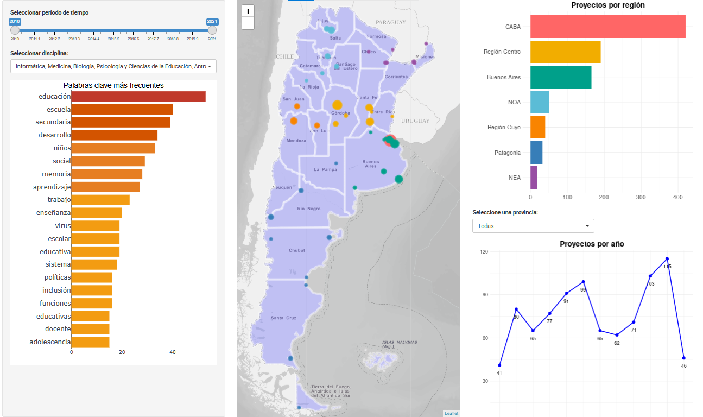

```{r submission-checks, echo=FALSE, warning=TRUE}
# Runs some basic checks in metadata. To disable, set check_is_error to FALSE
latinr::latinr_checks(rmarkdown::metadata, params$check_is_error)
```

```{r setup, include=FALSE}
knitr::opts_chunk$set(echo = TRUE)
```

# 1. Introducción

En Argentina, la problemática del desarrollo infantil integral y en particular de la “primera infancia” ganó relevancia en la agenda política de las últimas décadas a partir de la sanción de leyes y el despliegue de políticas públicas orientadas a promover el desarrollo de niños, niñas y adolescentes (NNyA). Ello se produjo en diálogo con agendas internacionales y regionales que demandaron acciones de los gobiernos nacionales, provinciales y municipales a partir de la agudización de los índices de pobreza y desigualdad en NNyA de todo el mundo.
Este periodo coincide con el despliegue de políticas científicas que apuntaron a una valorización creciente de las áreas de ciencia y tecnología como herramientas fundamentales para  el desarrollo de la Argentina; y con el  posicionamiento discursivo del Estado de orientar la ciencia hacia la resolución de problemas sociales. Lo dicho se expresó, en términos concretos, en el aumento progresivo del presupuesto hasta el año 2015, que se volcó en nuevas infraestructuras, subsidios para investigación y formación de recursos humanos particularmente a través del CONICET.
En este contexto político de puesta en valor de la ciencia como instrumento de desarrollo, comenzamos a preguntarnos por su consonancia con la agenda científica local.  Especificamente, nos preguntamos si la agenda política local en torno al desarrollo infantil era acompañada por un crecimiento en el financiamiento de proyectos de investigación científica orientados al tema.  Para dar respuesta a este interrogante, realizamos pedidos de información pública CONICET con el objetivo de analizar el comportamiento de las becas e ingresos otorgados por organismo en el periodo 2010-2020 a candidatos y candidatas con temas vinculados al desarrollo de NNyA. Nos propusimos analizar, en términos cuantitativos, si la creciente relevancia pública otorgada a esta problemática se vio acompañada de un aumento en el ingreso de becarios e investigadores al CONICET interesados en temáticas afines. En el año 2024, realizamos una primera publicación de dichos análisis en un artículo científico y pusimos a disposición los datos tal como fueron procesados en un repositorio de Github. Los resultados obtenidos mostraron la relevancia pública otorgada al desarrollo infantil durante el período analizado a partir del interés del Estado por financiar proyectos sobre estos temas.
A partir de ello, decidimos avanzar hacia la creación de una aplicación web que permitiera el acceso y la exploración de los datos recolectados para colegas tanto del ámbito académico como del ámbito profesional que estuvieran interesados/as en comprender la inserción de estas temáticas a lo largo de la Argentina. Por un lado, consideramos que este tipo de herramienta podría ser relevante para la construcción y fortalecimiento de redes entre equipos profesionales y/o de investigación que tengan temáticas, intereses y objetivos en común. A la vez, creemos que la disponibilidad y accesibilidad de estos datos es importante para la toma de decisiones, resolución de problemas e innovación científico tecnológica. En concreto, pensamos en la construcción de una herramienta que permita analizar las agendas de investigación en la Argentina y tomar decisiones basadas tanto en los datos disponibles como en los objetivos de los organismos, institutos, grupos de investigación e individuos.


# 2. Obtención de los datos

Los datos requeridos para los análisis fueron solicitados a CONICET a través de la plataforma de Trámites a Distancia (TAD, https://tramitesadistancia.gob.ar) bajo la modalidad de Acceso a la Información Pública. En particular, se solicitó información sobre las becas otorgadas e ingresos a CIC entre los años 2010 y 2020 para Temas Generales y Temas Estratégicos. Para identificar aquellos proyectos asociados al estudio del desarrollo de NNyA, se consensuaron una serie de criterios de inclusión basados en el análisis del título, resumen y palabras clave de los proyectos.  La selección de los proyectos fue realizada de forma manual por cuatro asistentes de investigación. 

# 3. Implementación de una Shiny para el acceso a los datos

Con el objetivo de disponibilizar los datos al público tanto académico como profesional, se desarrolló una aplicación web interactiva (Figura 1) que permite visualizar la distribución de los distintos proyectos de investigación sobre desarrollo de NNyA de acuerdo al año de la convocatoria (de 2010 a 2020), por el tipo de ingreso (beca doctoral, beca postdoctoral, o CIC), el tipo de modalidad (temas generales o específicos), la comisión evaluadora, y la región del país donde está radicado el ingreso. 
Por otro lado, la shiny incluye un mapa interactivo que, al día de hoy, permite visualizar la distribución geográfica de los distintos proyectos y explorar el cambio en dicha distribución a lo largo de los años. Finalmente, se pone a disposición una tabla interactiva que permite filtrar los distintos proyectos a partir de las categorías propuestas. 

```{r Figura-1, echo=FALSE, fig.cap="Panel central de la Aplicación Shiny", out.width = '100%'}

```

Todos los análisis se realizaron mediante el lenguaje R versión 4.2.1 \citep{R-base}, en Rstudio \citep{R-studio}. Los principales paquetes utilizados fueron dplyr \citep{R-dplyr}, ggplot2 \citep{R-ggplot2}, leaflet \citep{R-leaflet}, y geoAr \citep{R-geoAr}.

# 4. Direcciones futuras

Lo realizado hasta ahora permitió implementar una herramienta accesible para cualquier profesional, docente o investigador que esté interesado en conocer qué grupos investigan qué temas en la Argentina. En el futuro inmediato, esperamos poder incorporar métodos de aprendizaje automático que identifiquen los distintos tópicos presentes en las agendas de investigación y su prevalencia a lo largo de los años y de las distintas regiones del país. En el mediano plazo, también esperamos poder construir una infraestructura capaz de incorporar nuevos datos (e.g. provenientes de nuevos ingresos de becarios e investigadores) de forma rápida y con la menor intervención humana posible. Finalmente, en el largo plazo esperamos poder generalizar esta herramienta hacia una aplicación o sistema de monitoreo que permita el análisis y la exploración de agendas de investigación de diversas áreas y temáticas con el fin de que sirva al Estado y a sus diversos organismos de Ciencia y Tecnología para tomar decisiones y establecer agendas de investigación.

\bibliography{latinr_bibliography}